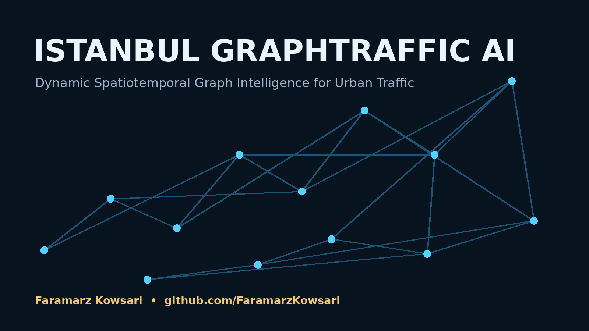

# İstanbul GraphTraffic AI

**Dynamic, uncertainty-aware spatiotemporal graph learning for multi-horizon traffic forecasting in Istanbul.**

<p align="center">
  
</p>

<p align="center">
  <a href="https://github.com/FaramarzKowsari/istanbul-graphtraffic-ai/actions"></a>
  <a href="LICENSE"></a>
  <a href="CITATION.cff"></a>
  
  
</p>

## Research objective

İstanbul GraphTraffic AI studies whether **road-topology-aware and adaptive graph models** can improve hourly, multi-horizon traffic forecasting in Istanbul while remaining calibrated under uncertainty and robust to sensor failures.

The project is intentionally designed as a **research pipeline**, not a results showcase. No benchmark claim is included until the corresponding experiment has been run on the documented Istanbul dataset and exported with provenance.

### Core questions

1. Does a directed road-topology graph outperform purely geographic sensor adjacency?
2. Does a learned dynamic graph add predictive value beyond a static road graph?
3. How do ST-GNN and Graph Transformer variants compare at +1h, +2h, +3h, and +6h horizons?
4. How well calibrated are predictive intervals across districts, time-of-day, and congestion regimes?
5. How quickly does performance degrade when 10%, 20%, or 30% of sensors are missing?
6. Are Bosphorus crossings and major arterial bottlenecks represented as influential spatial dependencies by the learned model?

## Why this is not a duplicate of the 2024 IBB graph benchmark

The 2024 paper *IBB Traffic Graph Data: Benchmarking and Road Traffic Prediction Model* introduced a graph benchmark over Istanbul traffic sensors and a GLEE + ExtraTrees prediction pipeline. This repository deliberately targets a different research space:

- directed and weighted road-topology graph construction;
- static + learned dynamic adjacency;
- end-to-end spatiotemporal neural forecasting;
- multi-horizon prediction;
- predictive uncertainty and calibration;
- structured sensor-failure robustness;
- explicit ablations and confirmatory statistical analysis.

See [`docs/novelty_audit.md`](docs/novelty_audit.md).

## Data

The intended public source is Istanbul's **Hourly Traffic Density Data Set** listed by the B40 Open Data Portal and linked to the IBB Open Data platform. The public listing describes hourly Istanbul location, density, and traffic information.

This repository does **not** redistribute raw IBB data. Put downloaded files in `data/raw/` and run the schema adapter.

```bash
python scripts/inspect_raw_data.py data/raw/your_file.csv
python scripts/prepare_ibb_data.py --input data/raw/your_file.csv --output data/processed/traffic.csv
```

A synthetic dataset generator is included so the full pipeline and CI can be exercised without external downloads:

```bash
python scripts/generate_synthetic.py --hours 336 --sensors 48
```

## Installation

```bash
git clone https://github.com/FaramarzKowsari/istanbul-graphtraffic-ai.git
cd istanbul-graphtraffic-ai
python -m venv .venv
# Windows
.venv\Scripts\activate
# macOS/Linux
# source .venv/bin/activate
pip install -r requirements.txt
pip install -e .
```

Optional road-topology dependencies:

```bash
pip install -r requirements-geo.txt
```

## Fast reproducibility check

```bash
python scripts/generate_synthetic.py --hours 240 --sensors 32
python scripts/build_graph.py --traffic data/processed/traffic.csv --mode knn
python scripts/train.py --config configs/smoke.yaml
python scripts/evaluate.py --config configs/smoke.yaml
pytest -q
```

## Real-data research workflow

```text
IBB hourly traffic files
        │
        ▼
Schema audit + normalization
        │
        ├──────────────► sensor metadata
        │
        ▼
Hourly tensor [time × sensor × features]
        │
        ├──────────────► geographic kNN graph (baseline)
        ├──────────────► road-topology graph (OSMnx)
        └──────────────► adaptive learned adjacency
        │
        ▼
Temporal windows
        │
        ├── Persistence / Historical Average
        ├── Temporal MLP / GRU
        ├── ST-GCN
        └── Dynamic Graph Transformer
        │
        ▼
+1h / +2h / +3h / +6h forecasts
        │
        ├── MAE / RMSE / MAPE / R²
        ├── Quantile coverage / interval width
        ├── sensor-failure robustness
        ├── spatial/regime slices
        └── ablation + paired statistical tests
        │
        ▼
Versioned artifacts + figures + research findings
```

## Repository map

```text
configs/                 Experiment configurations
data/                     Raw-data instructions and generated processed data
docs/                     GitHub Pages site + research documentation
reports/                  Generated tables and figures
scripts/                  Reproducible command-line entry points
src/graphtraffic/         Data, graph, model, metrics, training code
tests/                    Unit/smoke tests
.github/workflows/        CI and optional research workflows
```

## Models included

- Persistence baseline
- Historical-average baseline
- Temporal MLP
- ST-GCN-style graph recurrent forecaster
- Dynamic Graph Transformer with:
  - static adjacency mask;
  - adaptive node embeddings;
  - temporal GRU encoder;
  - spatial multi-head attention;
  - multi-horizon quantile outputs.

The main research model is implemented in [`src/graphtraffic/models/dynamic_graph_transformer.py`](src/graphtraffic/models/dynamic_graph_transformer.py).

## Reproducibility safeguards

- deterministic seeds;
- chronological train/validation/test splits;
- no random mixing of future observations into training windows;
- experiment configs stored in YAML;
- generated artifact manifest with SHA-256 hashes;
- no benchmark number written into the website unless exported by code;
- synthetic outputs are visibly labelled synthetic.

See [`REPRODUCIBILITY.md`](REPRODUCIBILITY.md) and [`docs/research_protocol.md`](docs/research_protocol.md).

## Research status

**v0.1.0 — protocol and executable pipeline.**

Included now: project architecture, synthetic smoke benchmark, data adapter, graph builders, neural models, uncertainty evaluation, failure experiments, tests, CI, and a publication-oriented website shell.

Not yet claimed: final IBB benchmark results, statistical superiority, calibrated real-world intervals, or production readiness.

## Author

<table>
<tr>
<td width="120"></td>
<td>
<strong>Faramarz Kowsari</strong><br>
Author · Software Engineer · AI Researcher<br>
Istanbul, Türkiye<br><br>
<a href="https://faramarzkowsari.github.io">Official Website</a> ·
<a href="https://github.com/FaramarzKowsari">GitHub</a> ·
<a href="https://orcid.org/0000-0003-1692-0453">ORCID</a> ·
<a href="https://scholar.google.com/citations?user=G7tP5WMAAAAJ&hl=en">Google Scholar</a>
</td>
</tr>
</table>

## Citation

Until a DOI is minted, cite the repository metadata in [`CITATION.cff`](CITATION.cff).

## License and data rights

Code in this repository is MIT licensed. External datasets retain their own licenses and terms. OpenStreetMap-derived network data require OpenStreetMap attribution and compliance with the ODbL. See [`docs/data_sources.md`](docs/data_sources.md).
