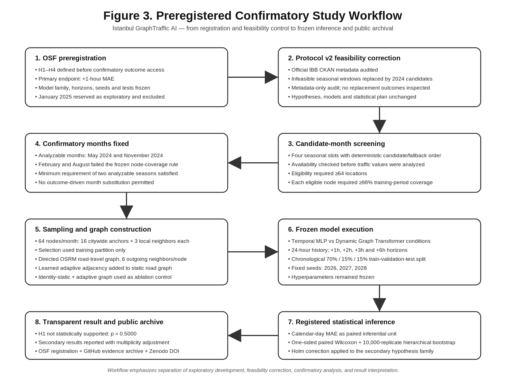
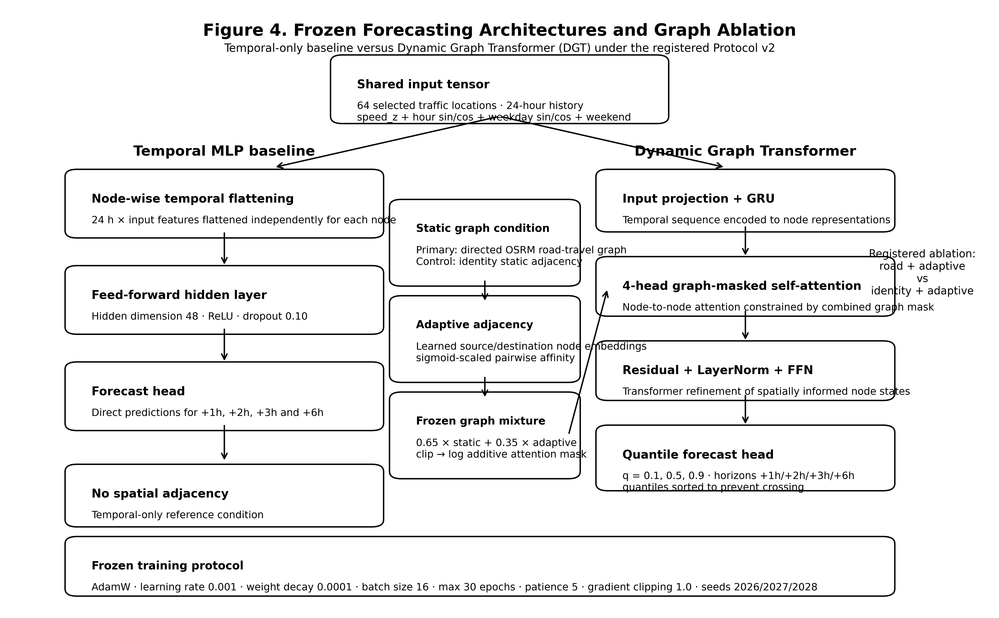
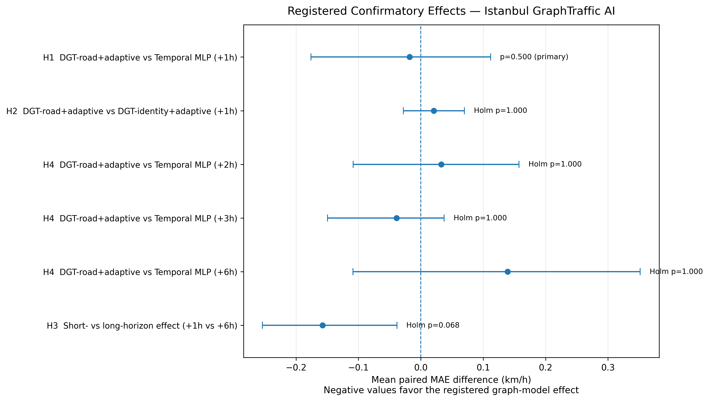
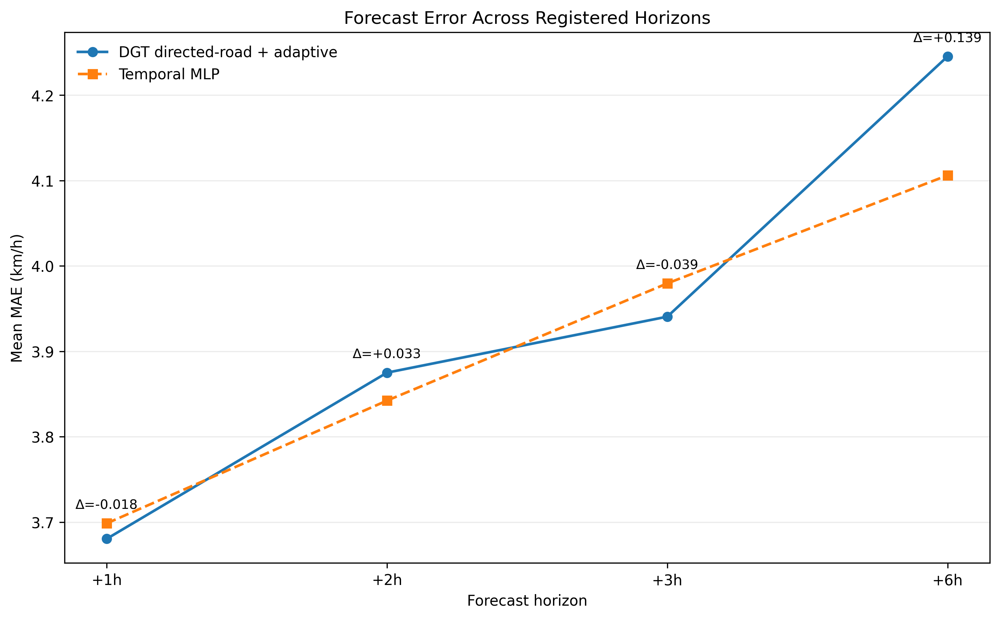

# Incremental Predictive Value of Spatial Graph Structure in Hourly Istanbul Traffic Forecasting: A Confirmatory Multi-Season Study

**Faramarz Kowsari**  
Software Engineer and AI Researcher, Istanbul, Türkiye  
ORCID: 0000-0003-1692-0453  
Correspondence: https://faramarzkowsari.github.io/

**Manuscript version:** v1.2  
**Date:** 16 August 2026  
**Study registration:** OSF Registries, DOI: 10.17605/OSF.IO/FM5R7  
**Versioned project archive:** Zenodo, DOI: 10.5281/zenodo.21916357  
**Code repository:** https://github.com/FaramarzKowsari/istanbul-graphtraffic-ai  
**Research website:** https://faramarzkowsari.github.io/istanbul-graphtraffic-ai/

---

## Abstract

Accurate traffic forecasting is a central problem in intelligent transportation systems, yet the incremental value of explicit road-graph structure can be difficult to establish once strong temporal information is already available. This preregistered confirmatory study tested whether directed road-travel graph information improves hourly traffic-speed forecasting in Istanbul beyond a temporal-only neural baseline. Public Istanbul Metropolitan Municipality (İBB) hourly traffic data were analyzed under a frozen Protocol v2 registered before confirmatory outcome access. The primary comparison evaluated a Dynamic Graph Transformer (DGT) combining directed road-travel adjacency with a learned adaptive adjacency against a Temporal Multilayer Perceptron (MLP) at the +1-hour horizon. Two confirmatory months, May and November 2024, satisfied the preregistered feasibility and coverage criteria. For each analyzable month, 64 traffic locations were selected using a deterministic citywide-anchor plus local-neighborhood procedure based only on the training partition. Models used a 24-hour input history, chronological 70%/15%/15% train/validation/test splits, fixed hyperparameters, and three random seeds. The primary inferential unit was calendar-day mean absolute error (MAE), averaged across nodes and neural seeds. The preregistered H1 comparison yielded a mean paired daily MAE difference of -0.0181 km/h for DGT directed-road + adaptive minus Temporal MLP, corresponding to -0.490%, with a 95% hierarchical bootstrap confidence interval of [-0.1760, +0.1120] km/h and a one-sided paired Wilcoxon p-value of 0.5000. H1 was therefore not statistically supported at alpha = 0.05. A secondary +1h-versus-+6h contrast showed a raw directional signal (p = 0.0137) but did not remain significant after the preregistered Holm correction (adjusted p = 0.0684). The results indicate that, under this frozen design and these confirmatory months, explicit directed road structure did not provide reliable incremental predictive value over the temporal baseline. The study illustrates the importance of preregistered ablation, transparent null-result reporting, and separating exploratory graph effects from confirmatory evidence in urban traffic forecasting.

**Keywords:** traffic forecasting; graph neural networks; Dynamic Graph Transformer; spatiotemporal learning; Istanbul; intelligent transportation systems; preregistration; reproducible research; road graphs; adaptive adjacency

---

## 1. Introduction

Urban traffic forecasting is a canonical spatiotemporal prediction problem. Traffic conditions evolve through recurrent temporal patterns while also being constrained by a physical road network whose geometry, directionality, connectivity, and travel times create spatial dependence. Modern forecasting systems therefore increasingly combine temporal representation learning with graph-based spatial modeling. Diffusion-based graph recurrent networks, spatiotemporal graph convolutional networks, attention-based graph models, adaptive graph learning, and graph-attention architectures have all demonstrated that representing traffic as a graph can improve prediction on widely used benchmarks [1-5].

However, two distinct scientific questions are often conflated. The first is whether a graph-based architecture can achieve strong predictive performance. The second is whether a particular explicit physical graph contributes predictive information beyond what is already captured by a strong temporal model and a learned adaptive graph. The latter question is more demanding because road topology may be partly redundant with temporal regularities, latent spatial correlations, learned node interactions, or feature engineering.

This distinction is especially relevant in Istanbul. Olug et al. introduced an Istanbul-specific traffic graph benchmark covering 2,451 locations and proposed a prediction pipeline based on temporal feature engineering, graph Laplacian eigenmap embeddings, and ExtraTrees [8]. That work established the value of an Istanbul-specific graph benchmark, but it did not answer the confirmatory question studied here: whether directed road-travel structure provides incremental predictive value when added to an end-to-end neural forecasting system that already incorporates strong temporal information and learned adaptive adjacency.

The present work therefore focuses on an ablation-centered and preregistered research question rather than a state-of-the-art performance claim. The primary question is:

> At the +1-hour forecast horizon, does a Dynamic Graph Transformer using directed road-travel structure plus adaptive adjacency achieve lower held-out MAE than a temporal-only MLP?

The study was designed with three methodological priorities. First, the primary hypothesis, model family, forecast horizons, hyperparameters, seeds, data-selection rules, statistical tests, and multiplicity procedure were frozen before confirmatory outcome access. Second, exploratory January 2025 analyses were explicitly excluded from confirmatory inference. Third, the final report preserves the preregistered result regardless of statistical significance or direction.

The main contribution is therefore not a claim that graph models outperform existing methods. Instead, this study contributes a reproducible confirmatory test of the incremental value of directed physical graph structure in hourly Istanbul traffic forecasting, with transparent reporting of a primary null result and a fully archived analysis trail.

---

## 2. Related Work

### 2.1 Graph-based traffic forecasting

Li et al. proposed the Diffusion Convolutional Recurrent Neural Network (DCRNN), modeling traffic as a diffusion process on a directed graph and combining graph diffusion with recurrent sequence modeling [1]. This work established directed graph structure as a natural inductive bias for traffic forecasting.

Yu et al. introduced Spatio-Temporal Graph Convolutional Networks (STGCN), using graph convolution together with temporal convolution to model spatial and temporal dependencies without recurrent units [2]. Guo et al. later proposed ASTGCN, adding spatial and temporal attention mechanisms to dynamically reweight dependencies across locations and time [3].

A key limitation of fixed physical graphs is that observed statistical dependence may not be fully represented by the known road network. Graph WaveNet addressed this problem through a learnable adaptive dependency matrix, enabling hidden spatial relationships to be inferred directly from data [4]. This idea is particularly relevant to the present study because the confirmatory graph model does not rely solely on physical road structure; it combines static road-travel adjacency with learned adaptive adjacency.

Attention-based traffic forecasting has also become increasingly prominent. GMAN uses graph multi-attention blocks and an encoder-decoder architecture to model spatiotemporal relationships [5]. More broadly, Transformer-style self-attention provides a flexible mechanism for learning interactions among elements without recurrence [6]. Recent traffic-specific graph Transformer variants have continued this direction by modeling dynamic spatial relations, spatiotemporal heterogeneity, and computationally efficient global-local interactions [7,9,10].

The literature available through August 2026 also shows that traffic forecasting research is moving beyond increasingly elaborate fixed architectures toward stronger representation learning, generalization, and robustness. GDGCRN explicitly models multiscale temporal dynamics, sensor-specific spatial heterogeneity, and signal decoupling [11], while GAPSTGCN introduces a pre-training/fine-tuning paradigm for spatiotemporal graph forecasting [12]. These developments reinforce an important methodological distinction for the present study: architectural sophistication and benchmark accuracy do not by themselves establish that a specific physical road adjacency provides incremental predictive information once strong temporal and adaptive spatial representations are already present.

### 2.2 Istanbul-specific traffic graph modeling

Olug et al. introduced the IBB Traffic Graph Data benchmark using observations from 2,451 Istanbul locations [8]. Their pipeline combined temporal feature engineering, GLEE node embeddings, and ExtraTrees. The work is an important Istanbul-specific reference because it demonstrates both the scale of the İBB traffic data and the relevance of graph representation learning in this urban context.

The present study differs in scientific purpose and model design. It does not simply convert the same traffic locations into nodes and apply a generic GNN. Instead, it evaluates: (i) a directed and weighted road-travel graph, (ii) an adaptive learned graph component, (iii) end-to-end neural forecasting, (iv) multiple horizons, and (v) paired statistical ablations under a preregistered confirmatory protocol. These design boundaries were documented before confirmatory execution.

### 2.3 Why incremental graph value requires confirmatory ablation

High-performing graph models do not necessarily imply that the explicit graph is causally or predictively essential. A flexible neural model may learn much of the same information from temporal history, calendar features, adaptive adjacency, or node-specific representations. Consequently, evaluating only absolute forecasting performance can overstate the role of the physical graph.

A stricter design compares a graph condition to carefully matched controls. Here, the directed-road + adaptive DGT is compared both with a temporal-only MLP and with an identity-static-adjacency + adaptive DGT. This separates the value of the overall graph architecture from the specific contribution of directed road structure.

---

## 3. Study Design and Preregistration

The study was preregistered in OSF Registries under DOI 10.17605/OSF.IO/FM5R7. The original registration fixed seasonal confirmatory months in 2025. A first registered execution terminated automatically because fewer than two preregistered seasonal months were analyzable under the frozen resource-availability rule.

A subsequent metadata-only audit of the official İBB CKAN package found 61 resources and showed that the originally preregistered post-January 2025 seasonal resources were not exposed in the official resource metadata. No traffic values from replacement months were downloaded or inspected during this audit.

Protocol v2 was therefore created as a feasibility correction before confirmatory outcome access. The revised protocol changed only the infeasible seasonal calendar windows to corresponding 2024 candidate months visible in the official resource metadata. The following elements remained unchanged in principle:

- the research questions and H1-H4 hypotheses;
- the primary endpoint (+1h MAE);
- model families and architecture controls;
- the 64-node selection design;
- input history and forecast horizons;
- fixed hyperparameters;
- random seeds;
- chronological data splitting;
- paired Wilcoxon tests;
- hierarchical bootstrap procedure;
- Holm multiplicity adjustment for the secondary family;
- exclusion of January 2025 from confirmatory inference.

No model, seed, hyperparameter, graph condition, statistical test, or hypothesis was changed in response to confirmatory performance.

**Figure 3. Preregistered confirmatory study workflow.** The figure separates the original OSF preregistration, the metadata-only feasibility correction that produced Protocol v2, seasonal eligibility screening, deterministic 64-node sampling, directed road-graph construction, frozen model execution, registered H1-H4 inference, and public archival. The feasibility correction preceded confirmatory outcome access and did not modify the registered hypotheses, statistical tests, seeds, or model conditions.

---

## 4. Data

### 4.1 Data source

The study used the publicly available Istanbul Metropolitan Municipality (İBB) Hourly Traffic Density Data Set. The forecasting target was average traffic speed in the source unit of km/h. Spatial information included traffic-location identifiers and geographic coordinates.

The confirmatory pipeline used the following input features:

- standardized speed (`speed_z`);
- sine and cosine encoding of hour of day;
- sine and cosine encoding of day of week;
- weekend indicator.

The input-history window was 24 hours. Forecast horizons were +1h, +2h, +3h, and +6h.

### 4.2 Seasonal candidate design

Protocol v2 fixed four seasonal slots and a deterministic candidate/fallback order:

| Seasonal slot | Primary candidate | Fallback |
|---|---:|---:|
| Winter | 2024-02 | 2024-03 |
| Spring | 2024-05 | 2024-04 |
| Summer | 2024-08 | 2024-07 |
| Autumn | 2024-11 | 2024-10 |

For each seasonal slot, availability was determined from official resource metadata before traffic values were downloaded or inspected. A month could be excluded from confirmatory inference only if the official resource was unavailable or fewer than 64 nodes satisfied the preregistered training-only coverage rule.

The final analyzable confirmatory months were **2024-05** and **2024-11**. February and August 2024 did not satisfy the preregistered requirement of at least 64 locations with 98% training-period unique-hour coverage.

January 2025 was explicitly excluded because it had been used previously for exploratory pipeline validation, sampling experiments, graph ablations, road-graph comparisons, and residual graph-signal analyses.

### 4.3 Node eligibility and deterministic selection

Within each confirmatory month, node eligibility was determined using only the training partition. A traffic location had to achieve at least 98% unique-hour coverage during training.

Exactly 64 eligible locations were then selected using a deterministic citywide-anchor plus local-neighborhood procedure. Sixteen geographically diverse anchor locations were selected, and three nearest unused eligible locations were added around each anchor, producing clusters of four locations and a total of 64 nodes. Traffic-speed and vehicle-volume values were not used to select the nodes.

This procedure was designed to balance citywide geographic diversity with sufficient local density for graph-based spatial modeling.

---

## 5. Graph Construction

### 5.1 Directed road-travel graph

The physical graph was constructed from driving-route travel information obtained through the OSRM Table API using OpenStreetMap-derived routing. The graph was directed.

For each node, the six lowest-travel-time outgoing neighbors were retained. Directed edge weights were defined as

\[
w_{ij} = \exp\left(-\frac{t_{ij}}{\tau}\right),
\]

where \(t_{ij}\) is the directed travel time in seconds from node \(i\) to node \(j\), and \(\tau\) is the median selected outgoing travel time computed separately for each month.

This construction allows asymmetric travel relationships and assigns larger weights to more strongly connected locations under the travel-time metric.

### 5.2 Adaptive adjacency

The Dynamic Graph Transformer also learns an adaptive adjacency matrix from trainable source and destination node embeddings. If \(E_s\) and \(E_d\) denote these embeddings, adaptive adjacency is computed as a sigmoid transformation of scaled pairwise embedding products.

The model combines the normalized static adjacency and learned adaptive adjacency using a fixed mixture:

\[
A_{\text{combined}} = \mathrm{clip}(0.65 A_{\text{static}} + 0.35 A_{\text{adaptive}}, 0, 1).
\]

The resulting matrix is transformed into an additive attention mask through a log operation before multi-head attention.

### 5.3 Identity control graph

To isolate the incremental value of directed physical road structure, a matched DGT control used identity static adjacency plus the same adaptive graph mechanism. The main graph ablation therefore compared:

1. DGT directed-road + adaptive adjacency;
2. DGT identity-static + adaptive adjacency.

---

## 6. Forecasting Models

### 6.1 Temporal MLP

The Temporal MLP is a node-wise temporal baseline. For each node, the 24-hour history and input features are flattened and passed through a feed-forward network consisting of:

- a fully connected hidden layer;
- ReLU activation;
- dropout of 0.10;
- an output layer predicting the requested forecast horizons.

The Temporal MLP does not use spatial adjacency.

### 6.2 Dynamic Graph Transformer

The DGT combines temporal sequence encoding, graph-masked spatial attention, adaptive adjacency, and quantile prediction.

For each node, input features are first projected into the hidden dimension. A GRU then summarizes the 24-hour temporal sequence. The resulting node representations are passed through multi-head self-attention using the combined static-plus-adaptive graph as an additive attention mask. Residual connections, layer normalization, and a feed-forward block follow the attention layer.

The model emits quantile forecasts for each horizon and node. The default quantiles are 0.1, 0.5, and 0.9, and output quantiles are sorted to prevent quantile crossing.

**Figure 4. Frozen forecasting architectures and graph ablation.** The Temporal MLP uses node-wise temporal history without spatial adjacency. The Dynamic Graph Transformer combines GRU temporal encoding, multi-head graph-masked self-attention, residual/normalization/feed-forward processing, and quantile forecasting. The registered physical-graph ablation compares directed road-travel static adjacency plus adaptive adjacency against identity static adjacency plus the same adaptive mechanism while keeping the rest of the DGT condition fixed.

### 6.3 Frozen hyperparameters

Protocol v2 fixed the following neural hyperparameters before confirmatory outcome access:

| Hyperparameter | Value |
|---|---:|
| Hidden dimension | 48 |
| Attention heads | 4 |
| Dropout | 0.10 |
| Maximum epochs | 30 |
| Batch size | 16 |
| Learning rate | 0.001 |
| Weight decay | 0.0001 |
| Early-stopping patience | 5 |
| Random seeds | 2026, 2027, 2028 |

Models were trained with AdamW. DGT quantile outputs used pinball loss; non-quantile outputs used L1 loss. Gradient norms were clipped at 1.0. Model selection used validation loss with early stopping.

---

## 7. Experimental Protocol

### 7.1 Chronological splitting

Each confirmatory month was divided chronologically into:

- 70% training;
- 15% validation;
- 15% test.

No random temporal shuffling was used for the train/validation/test partition.

### 7.2 Forecast horizons

Four horizons were evaluated:

- +1 hour;
- +2 hours;
- +3 hours;
- +6 hours.

The +1h horizon was the preregistered primary endpoint.

### 7.3 Seed averaging and inferential units

Neural models were trained under three fixed random seeds: 2026, 2027, and 2028.

For inferential testing, MAE was first aggregated across nodes for each calendar test day and then averaged across neural seeds. Calendar-day MAE was therefore the statistical unit for paired hypothesis tests.

Across the two analyzable months, the confirmatory analysis contained 10 paired calendar-day units.

---

## 8. Hypotheses and Statistical Analysis

### 8.1 Primary hypothesis

**H1:** At +1h, DGT directed-road + adaptive has lower held-out MAE than Temporal MLP.

The preregistered directional alternative was:

\[
\mathrm{MAE}_{\text{DGT-road+adaptive}} <
\mathrm{MAE}_{\text{Temporal MLP}}.
\]

H1 was tested with a one-sided paired Wilcoxon signed-rank test at alpha = 0.05. H1 was the single primary confirmatory test and was not multiplicity-adjusted.

### 8.2 Secondary hypotheses

**H2:** At +1h, DGT directed-road + adaptive has lower MAE than DGT identity + adaptive.

**H3:** The incremental advantage of DGT directed-road + adaptive over Temporal MLP is larger at +1h than at +6h.

**H4:** DGT directed-road + adaptive has lower MAE than Temporal MLP at +2h, +3h, and +6h.

H2, H3, H4_2h, H4_3h, and H4_6h formed a single secondary family. Their p-values were adjusted using Holm's procedure.

### 8.3 Effect sizes and uncertainty

The primary effect measure was the mean paired daily MAE difference:

\[
\Delta = \mathrm{MAE}_{\text{model}}-\mathrm{MAE}_{\text{reference}}.
\]

Negative values therefore favor the registered graph model.

Relative MAE difference was also reported. Confidence intervals were estimated using a hierarchical bootstrap with 10,000 replicates, resampling months and then test days within sampled months. The bootstrap random seed was 20260814.

---

## 9. Results

### 9.1 Confirmatory feasibility

Two seasonal months satisfied the preregistered resource and node-coverage criteria: May 2024 and November 2024. The minimum requirement of at least two analyzable seasons was therefore met, and confirmatory inferential testing proceeded.

### 9.2 Primary H1 result

At +1h, mean MAE was 3.6804 km/h for DGT directed-road + adaptive and 3.6986 km/h for Temporal MLP.

The mean paired daily MAE difference was:

\[
\Delta_{\mathrm{H1}} = -0.0181 \text{ km/h},
\]

corresponding to a relative difference of -0.490%.

The 95% hierarchical bootstrap confidence interval was:

\[
[-0.1760,\ +0.1120] \text{ km/h}.
\]

The preregistered one-sided paired Wilcoxon p-value was:

\[
p = 0.5000.
\]

Because p > 0.05 and the bootstrap interval crossed zero, the preregistered H1 superiority hypothesis was **not statistically supported**.

### 9.3 Secondary registered results

| Hypothesis | Comparison | Horizon | Mean paired MAE difference (km/h) | Relative difference | 95% bootstrap CI (km/h) | Raw p | Holm-adjusted p |
|---|---|---:|---:|---:|---:|---:|---:|
| H1 | DGT road+adaptive vs Temporal MLP | +1h | -0.0181 | -0.490% | [-0.1760, +0.1120] | 0.500000 | — |
| H2 | DGT road+adaptive vs DGT identity+adaptive | +1h | +0.0207 | +0.565% | [-0.0281, +0.0700] | 0.903320 | 1.000000 |
| H4_2h | DGT road+adaptive vs Temporal MLP | +2h | +0.0327 | +0.852% | [-0.1085, +0.1575] | 0.753906 | 1.000000 |
| H4_3h | DGT road+adaptive vs Temporal MLP | +3h | -0.0390 | -0.979% | [-0.1495, +0.0376] | 0.347656 | 1.000000 |
| H4_6h | DGT road+adaptive vs Temporal MLP | +6h | +0.1392 | +3.391% | [-0.1086, +0.3518] | 0.975586 | 1.000000 |
| H3 | (+1h effect) vs (+6h effect) | +1h vs +6h | -0.1574 | -3.881% | [-0.2539, -0.0383] | 0.013672 | 0.068359 |

H2 did not support an incremental benefit of the directed road graph over the identity-static graph condition at +1h.

For H4, no horizon-specific DGT-versus-MLP comparison remained statistically significant. At +3h the estimated difference favored the graph model, whereas at +2h and +6h it favored the Temporal MLP, but all corresponding uncertainty intervals included zero.

H3 produced the strongest secondary directional signal. The +1h versus +6h effect contrast had a mean paired difference of -0.1574 km/h and an unadjusted p-value of 0.0137. However, the preregistered Holm-adjusted p-value was 0.0684. Therefore, H3 was **not statistically significant after correction for the registered secondary family**.

**Figure 1. Registered confirmatory effects.** Mean paired MAE differences are shown with 95% hierarchical-bootstrap confidence intervals. Negative differences favor the registered graph-model effect. H1 was the unadjusted primary test; H2, H3, and the three H4 horizon-specific tests belonged to the Holm-adjusted secondary family. The H3 interval is directional in the registered effect definition, but its Holm-adjusted p-value remained above 0.05.

**Figure 2. Mean forecast error across registered horizons.** Mean MAE for DGT directed-road + adaptive and Temporal MLP is shown at +1h, +2h, +3h, and +6h. The annotated differences are DGT minus Temporal MLP; negative values favor DGT. The graph model was numerically better at +1h and +3h and worse at +2h and +6h, but none of the horizon-specific registered superiority comparisons was statistically supported.

### 9.4 Interpretation boundary

The confirmatory evidence does not support a claim that the directed-road DGT is superior to the Temporal MLP under the tested design. It also does not establish that road graphs are generally unhelpful for traffic forecasting. The inference is narrower: under these two analyzable Istanbul months, the frozen 64-node sampling design, fixed architecture, fixed hyperparameters, and preregistered statistical procedure, directed road-travel structure did not yield a reliable incremental improvement in MAE.

---

## 10. Discussion

### 10.1 Main finding

The primary result is a small, non-significant -0.0181 km/h difference in favor of DGT directed-road + adaptive at +1h. The relative improvement of approximately 0.49% is substantially smaller than what would be needed to support a robust superiority conclusion given the observed day-to-day variation.

This result is scientifically informative because the experiment specifically tests the incremental value of explicit road topology rather than the overall capability of graph neural networks. A graph-based model can be expressive and useful while a particular physical graph contributes little beyond temporal history and learned adaptive relationships.

### 10.2 Why explicit road topology may add limited incremental value

Several mechanisms could explain the limited confirmatory gain.

First, hourly traffic speed exhibits strong temporal regularity. A 24-hour history window plus calendar encodings provides the Temporal MLP with substantial predictive information.

Second, the DGT already contains learned adaptive adjacency. If latent traffic dependencies correlate with physical road connectivity, the adaptive component may recover part of the relevant spatial structure without requiring strong additional contribution from the directed static graph.

Third, the graph operates on a selected 64-node subset rather than the full Istanbul network. Although the sampling design intentionally combines citywide anchors with local neighborhoods, some road-network propagation paths may pass through unobserved locations. Physical topology can therefore be informative in principle while only partially observable in the selected induced graph.

Fourth, the target is hourly average speed. Road propagation processes that matter at finer temporal resolutions may be attenuated after hourly aggregation.

### 10.3 Short-horizon versus long-horizon behavior

The H3 contrast suggested that the graph model's relative position was more favorable at +1h than at +6h. This pattern is compatible with the intuition that local spatial interactions are most useful at short horizons, whereas longer horizons become increasingly dominated by temporal regularity, uncertainty, and broader system dynamics.

Nevertheless, the H3 result did not survive the preregistered Holm correction. The correct confirmatory interpretation is therefore not that short-horizon graph superiority was established, but that the registered data contain a secondary pattern worthy of independent replication.

### 10.4 Importance of the null result

Negative and null results are especially valuable when they arise from a frozen analysis plan. Without preregistration, a researcher could easily respond to weak graph effects by changing months, node subsets, graph construction, seeds, architecture depth, statistical tests, or forecast horizons until a favorable result appears.

That did not occur here. The confirmatory pipeline preserved the registered model conditions and reported the primary result despite its non-significance. This strengthens the evidential value of the study even though the substantive hypothesis was not supported.

### 10.5 Relation to prior Istanbul work

The findings should not be interpreted as contradicting the Istanbul benchmark of Olug et al. [8]. Their study evaluated a different problem formulation and a different modeling pipeline based on temporal feature engineering, graph embeddings, and ExtraTrees over a substantially larger location set.

The present study asks a narrower ablation question: whether explicit directed road-travel structure adds predictive value beyond a temporal neural baseline and learned adaptive graph under a controlled confirmatory protocol. The results suggest that future Istanbul graph-forecasting work should distinguish between the benefit of graph-aware model capacity and the incremental benefit of a particular physical adjacency specification.

---

## 11. Limitations

Several limitations constrain the interpretation of this study.

**Number of analyzable seasons.** Only two of the four Protocol v2 seasonal slots satisfied the preregistered coverage criteria. The study met its minimum requirement for confirmatory inference, but the effective seasonal sample remains limited.

**Statistical unit count.** The confirmatory tests used 10 paired calendar-day units. This limits power for detecting small improvements.

**Restricted node set.** Each month used 64 selected locations rather than the complete Istanbul traffic network. The selection procedure was preregistered and deterministic, but graph effects could differ at larger spatial scale.

**Monthly graph variation.** Directed road graphs and travel-time scales were constructed separately for each month using the selected node set. This preserves month-specific consistency but may limit direct comparability of detailed graph structure across months.

**Hourly aggregation.** The target resolution may be too coarse to capture some rapid traffic-propagation effects.

**Single fixed architecture family.** The confirmatory inference applies to the specified Temporal MLP and DGT implementation with frozen hyperparameters. It does not establish a general ranking of all graph and non-graph architectures.

**No state-of-the-art claim.** The study was designed as a preregistered incremental-value test, not a broad leaderboard benchmark against every current traffic-forecasting model.

**Exploratory-development separation.** January 2025 informed the research design through exploratory work. Although it was excluded from confirmatory testing and the replacement confirmatory months were not inspected before Protocol v2 was frozen, the overall research questions were necessarily shaped by prior exploration.

---

## 12. Reproducibility and Research Integrity

The project preserves a complete public workflow intended to make the confirmatory analysis independently auditable.

The archive includes:

- frozen Protocol v2 configuration;
- OSF preregistration and public update;
- resource-availability audit;
- selected-node files;
- graph diagnostics;
- OSRM routing matrices and responses;
- raw-source provenance;
- fixed random seeds;
- model code;
- confirmatory metrics;
- daily paired errors;
- registered effect table;
- bootstrap metadata;
- hypothesis-test results;
- SHA-256 artifact checksums.

The registered confirmatory result is archived independently of whether it supports the original hypothesis.

Synthetic data in the repository are used only for pipeline smoke testing and are not treated as evidence for the real-data confirmatory conclusions.

---

## 13. Data and Code Availability

The public project repository is:

https://github.com/FaramarzKowsari/istanbul-graphtraffic-ai

The research website is:

https://faramarzkowsari.github.io/istanbul-graphtraffic-ai/

The registered confirmatory results page is:

https://faramarzkowsari.github.io/istanbul-graphtraffic-ai/confirmatory-results.html

The machine-readable confirmatory dataset landing page is:

https://faramarzkowsari.github.io/istanbul-graphtraffic-ai/registered-confirmatory-dataset.html

The OSF registration is:

https://doi.org/10.17605/OSF.IO/FM5R7

The versioned project release is archived at:

https://doi.org/10.5281/zenodo.21916357

The underlying İBB source data remain subject to the source provider's terms and availability. Derived confirmatory outputs published by this project are distributed under CC BY 4.0 where indicated.

---

## 14. Ethics Statement

The study analyzes publicly available aggregate traffic data and does not involve human participants, clinical data, personal identifiers, or intervention on individuals. No human-subject experimentation was conducted.

---

## 15. Funding

No external funding is declared for this study.

---

## 16. Competing Interests

The author declares no competing interests.

---

## 17. Author Contributions

Faramarz Kowsari: conceptualization, methodology, software, data curation, formal analysis, validation, visualization, reproducibility engineering, writing - original draft, writing - review and editing, project administration.

---

## 18. Acknowledgments

The author acknowledges Istanbul Metropolitan Municipality for making the traffic data publicly accessible and the open-source communities supporting Python, PyTorch, OpenStreetMap, OSRM, and the broader scientific software ecosystem.

---

## References

[1] Li, Y., Yu, R., Shahabi, C., & Liu, Y. (2018). Diffusion Convolutional Recurrent Neural Network: Data-Driven Traffic Forecasting. *International Conference on Learning Representations (ICLR)*. arXiv:1707.01926.

[2] Yu, B., Yin, H., & Zhu, Z. (2018). Spatio-Temporal Graph Convolutional Networks: A Deep Learning Framework for Traffic Forecasting. *Proceedings of the Twenty-Seventh International Joint Conference on Artificial Intelligence*, 3634-3640. https://doi.org/10.24963/ijcai.2018/505

[3] Guo, S., Lin, Y., Feng, N., Song, C., & Wan, H. (2019). Attention Based Spatial-Temporal Graph Convolutional Networks for Traffic Flow Forecasting. *Proceedings of the AAAI Conference on Artificial Intelligence*, 33(01), 922-929. https://doi.org/10.1609/aaai.v33i01.3301922

[4] Wu, Z., Pan, S., Long, G., Jiang, J., & Zhang, C. (2019). Graph WaveNet for Deep Spatial-Temporal Graph Modeling. *Proceedings of the Twenty-Eighth International Joint Conference on Artificial Intelligence*, 1907-1913. https://doi.org/10.24963/ijcai.2019/264

[5] Zheng, C., Fan, X., Wang, C., & Qi, J. (2020). GMAN: A Graph Multi-Attention Network for Traffic Prediction. *Proceedings of the AAAI Conference on Artificial Intelligence*, 34(01), 1234-1241. https://doi.org/10.1609/aaai.v34i01.5477

[6] Vaswani, A., Shazeer, N., Parmar, N., Uszkoreit, J., Jones, L., Gomez, A. N., Kaiser, L., & Polosukhin, I. (2017). Attention Is All You Need. *Advances in Neural Information Processing Systems*, 30.

[7] Huang, S., Song, H., Jiang, T., Telikani, A., Shen, J., Zhou, Q., Yong, B., & Wu, Q. (2024). DST-GTN: Dynamic Spatio-Temporal Graph Transformer Network for Traffic Forecasting. arXiv:2404.11996.

[8] Olug, E., Kaya, K., Tugay, R., & Oguducu, S. G. (2024). IBB Traffic Graph Data: Benchmarking and Road Traffic Prediction Model. *2024 IEEE 29th International Workshop on Computer Aided Modeling and Design of Communication Links and Networks (CAMAD)*. https://doi.org/10.1109/CAMAD62243.2024.10943048

[9] Zhou, J., Liu, E., Chen, W., Zhong, S., & Liang, Y. (2024). Navigating Spatio-Temporal Heterogeneity: A Graph Transformer Approach for Traffic Forecasting. *arXiv preprint arXiv:2408.10822*. https://arxiv.org/abs/2408.10822

[10] Wang, H., Chen, J., Pan, T., Dong, Z., Zhang, L., Jiang, R., & Song, X. (2024). STGformer: Efficient Spatiotemporal Graph Transformer for Traffic Forecasting. *arXiv preprint arXiv:2410.00385*. https://arxiv.org/abs/2410.00385

[11] Yang, S., Huang, Z., Wu, Q., & Zhuo, Z. (2025). General Decoupled Graph Convolutional Recurrent Network for Traffic Prediction. *IEEE Sensors Journal, 25*(18), 35460–35478. https://doi.org/10.1109/JSEN.2025.3580440

[12] Zhao, Z., Shen, G., Zhou, W., Qi, J., Liu, Y., & Kong, X. (2026). Generative Adversarial Pre-Training Enabled Spatial–Temporal Graph Modeling of Traffic Data. *IEEE Transactions on Intelligent Transportation Systems, 27*(2), 2056–2071. https://doi.org/10.1109/TITS.2025.3633688

---

## Appendix A. Registered Hypotheses

**H1 — Primary, directional.** At +1h, DGT directed-road + adaptive has lower held-out MAE than Temporal MLP.

**H2 — Secondary, directional.** At +1h, DGT directed-road + adaptive has lower held-out MAE than DGT identity + adaptive.

**H3 — Secondary, directional.** The incremental predictive benefit of DGT directed-road + adaptive relative to Temporal MLP is larger at +1h than at +6h.

**H4 — Secondary, directional.** At +2h, +3h, and +6h, DGT directed-road + adaptive has lower held-out MAE than Temporal MLP.

---

## Appendix B. Confirmatory Effect Table

| Hypothesis | Horizon | Mean model MAE | Mean reference MAE | Paired difference | Relative difference | 95% CI | Raw p | Holm p |
|---|---:|---:|---:|---:|---:|---:|---:|---:|
| H1 | +1h | 3.6804 | 3.6986 | -0.0181 | -0.490% | [-0.1760, +0.1120] | 0.500000 | — |
| H2 | +1h | 3.6804 | 3.6597 | +0.0207 | +0.565% | [-0.0281, +0.0700] | 0.903320 | 1.000000 |
| H4_2h | +2h | 3.8750 | 3.8423 | +0.0327 | +0.852% | [-0.1085, +0.1575] | 0.753906 | 1.000000 |
| H4_3h | +3h | 3.9406 | 3.9795 | -0.0390 | -0.979% | [-0.1495, +0.0376] | 0.347656 | 1.000000 |
| H4_6h | +6h | 4.2453 | 4.1061 | +0.1392 | +3.391% | [-0.1086, +0.3518] | 0.975586 | 1.000000 |
| H3 | +1h vs +6h | — | — | -0.1574 | -3.881% | [-0.2539, -0.0383] | 0.013672 | 0.068359 |

---

## Appendix C. Manuscript Status

Manuscript v1.2 integrates four publication figures and their journal-style captions, preserves the preregistered methods and confirmatory interpretation, and incorporates a literature audit updated through 16 August 2026.

The following publication-production tasks remain before preprint submission:

1. journal/preprint-specific reference formatting;
2. final language and statistical consistency check;
3. creation and visual inspection of a searchable publication PDF;
4. insertion of the final preprint DOI/URL after deposit.

Vector SVG versions of Figures 1-4 are archived in `manuscript/figures/` alongside the PNG versions embedded in this Markdown manuscript.
